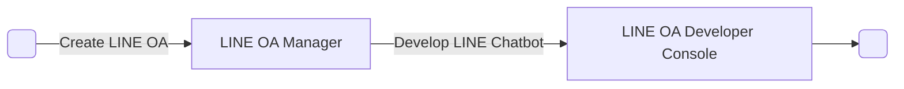

# สร้าง LINE OA และเปิดใช้งาน Messaging API

#### Original Content from: https://codelab.line.me/codelabs/chatbot-x-gemini/index.html#1

#### Link Hub:
- LINE OA Manager: https://manager.line.biz
- LINE Developers Console: https://developers.line.biz/console/

## Main Step
1. สร้าง LINE Official Account
2. เปิดใช้งาน Messaging API
3. เพิ่ม Chatbot เป็นเพื่อนและตั้งค่า Channel

## Objective 
สามารถสร้าง LINE Official Account และเปิดใช้งาน Developer Console ได้


## 1. สร้าง LINE Official Account


```
จุดเริ่มต้นของการพัฒนา LINE Chatbot คือคุณจะต้องสร้าง LINE OA(LINE Official Account) และเปิดใช้งาน Messaging API
```


1. เข้าไปที่ https://manager.line.biz แล้วเลือก Log in with LINE account(สีเขียว) เพื่อเข้าสู่ระบบ


2. เข้าสู่ระบบด้วยบัญชี LINE ของคุณให้เรียบร้อย
กดสร้าง LINE OA จากปุ่ม Create LINE official account สำหรับผู้ทีสร้าง LINE OA ครั้งแรก หรือกด Create new ทางด้านซ้ายสำหรับผู้ที่เคยสร้าง LINE OA แล้ว


3. ให้ระบุข้อมูลต่างๆลงไปในฟอร์ม แล้วกด ตกลง


4. จากนั้นให้ยืนยันรายละเอียดในการสร้าง LINE OA เป็นอันเสร็จสิ้น


## 2. เปิดใช้งาน Messaging API
หลังจากที่เรามี LINE OA เรียบร้อยแล้ว ขั้นตอนนี้จะพาทุกคนไปเพิ่มความสามารถให้ LINE OA ของเรากลายเป็น LINE Chatbot ได้

1. เข้าไปที่ https://manager.line.biz ในกรณีที่เรามีบัญชี LINE OA ที่สร้างไว้แล้ว หน้านี้จะแสดงบัญชี LINE OA ต่างๆที่เรามี ก็ให้เรากดเลือกบัญชี LINE OA ที่เราต้องการ


2. ให้เราไปทีเมนู Settings > Messaging API แล้วให้กดปุ่ม Enable Messaging API


3. หากเป็นการ Enable Messaging API ครั้งแรกของบัญชี LINE Business ID จะเจอหน้าให้ลงทะเบียน Developer info ก็ให้กรอก ชื่อ และ อีเมล


4. จากนั้นให้สร้าง Provider ใหม่ หรือเลือก Provider เดิมกรณีที่เคยสร้างไปแล้ว


```
#### NOTE ####
Note: Provider คือชื่อผู้ให้บริการ ซึ่งจะไปแสดงตามหน้า consent ต่างๆ ซึ่งถือเป็น superset ของ chatbot ทั้งหลายที่เราจะพัฒนาขึ้นรวมถึง LIFF app โดยเราสามารถระบุชื่อของ Provider เป็น ชื่อตัวเอง, ชื่อบริษัท, ชื่อทีม หรือชื่อกลุ่มก็ได้


#### REMEMBER ####
Remember: 1 Account สามารถมี Provider สูงสุดได้ 10 Providers และไม่สามารถมีคำว่า LINE ในชื่อ Provider ได้
```


5. ระบุ URL ของ Privacy Policy และ Terms of Use (ถ้ามี) หากยังไม่มีก็สามารถกดปุ่ม ok ข้ามไปได้


6. ยืนยันการเปิดใช้งาน Messaging API ด้วยการกด Ok


7. เมื่อเจอหน้านี้ ก็แปลว่าคุณได้เปิดใช้งาน Messaging API ให้กับบัญชี LINE OA เรียบร้อยแล้ว


## 3. เพิ่ม Chatbot เป็นเพื่อนและตั้งค่า Channel
ขั้นตอนนี้เราจะเข้าไปใช้งาน LINE Developers Console ซึ่งเป็นเว็บไซต์สำหรับการบริหารจัดการ LINE Chatbot(LINE OA ที่เปิดใช้งาน Messaging API แล้ว) ในส่วนของนักพัฒนา

1. เข้าไปที่ https://developers.line.biz/console/
ให้กดเลือก Provider ที่ต้องการ


2. เราจะพบกับบัญชี LINE OA ที่เราได้เปิดใช้งาน Messaging API ไว้ ซึ่งในที่นี้เราจะเรียกมันว่า Channel(Channel จะเปรียบเสมือน Chatbot หรือ App) ก็ให้กดเลือก Channel ที่ต้องการ


3. ให้ไปที่ Tab ชื่อ Messaging API และทำการแสกน QR code ด้วยแอป LINE เพื่อเพิ่ม Chatbot เป็นเพื่อน


4. ให้ปิด Auto-reply messages เนื่องจากฟีเจอร์นี้จะเป็น default การตอบกลับของ Chatbot ซึ่งไม่จำเป็นต้องใช้ฟีเจอร์นี้


5. กลับมาที่ Channel ที่เราสร้างใน Tab ชื่อ Messaging API ตรงส่วนของ Channel access token ให้กดปุ่ม Issue


```
### IMOPORTANT
Important: ตัว Channel Access Token คือกุญแจสำคัญในการใช้งาน Messaging API ดังนั้นให้เก็บรักษาไว้ให้ดี
```